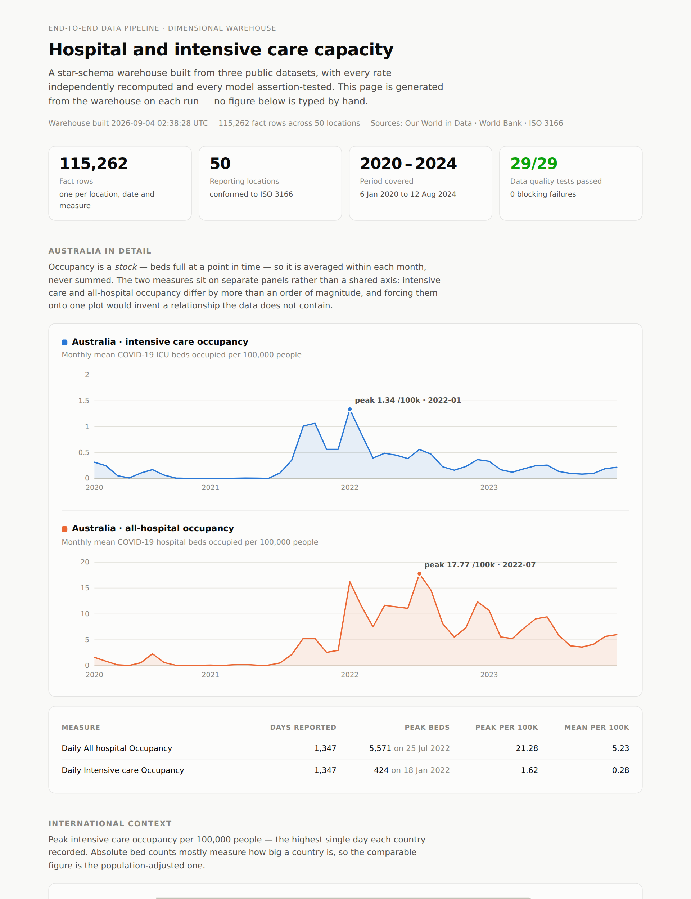

# Hospital capacity data pipeline

An end-to-end data pipeline: three public datasets are ingested with full
provenance, cleaned in Python, modelled into a dimensional warehouse in SQL,
gated by 29 declarative data quality assertions, and published as a dashboard —
all with one command.

```bash
make setup && make all
```

**[▶ View the published dashboard](https://shobhana25.github.io/End-to-end-data-pipeline-project/)**  ·  [Architecture](docs/architecture.md)  ·  [Data dictionary](docs/data_dictionary.md)  ·  [Adding a source](docs/adding_a_source.md)

<picture>
  <source media="(prefers-color-scheme: dark)" srcset="docs/dashboard-dark.png">
  
</picture>

---

## What it does

```
ingest ──▶ stage ──▶ transform ──▶ quality ──▶ dashboard
Python     Python      SQL          SQL         static HTML
```

| Stage | What happens |
| --- | --- |
| **Ingest** | Declared sources are fetched with retries and exponential backoff, streamed to a temporary file and atomically renamed into an immutable landing zone. Every payload is SHA-256 checksummed and recorded in a manifest that becomes a table in the warehouse. |
| **Stage** | Each file is checked against its declared column contract, typed, normalised, deduplicated on its natural key, and written as Parquet. Free-text indicator labels are parsed into structured attributes; statistical outliers are flagged. |
| **Transform** | Plain SQL — no templating, no macros — builds three conformed dimensions, two facts at different grains, and four reporting marts in DuckDB. Every model is `CREATE OR REPLACE`, so the build is idempotent. |
| **Quality** | 29 declarative assertions covering key uniqueness, the declared fact grain, referential integrity across the star, domain values, business rules and an independent rate reconciliation. Results are written to the warehouse. A blocking failure stops the run. |
| **Dashboard** | A self-contained HTML page rendered from the reporting marts, plus a Streamlit app for exploration. No CDN, no bundler, no charting library — one file that opens anywhere. |

Roughly **115,000 fact rows across 50 reporting locations, 2020–2024**, built
from scratch in about 2.5 seconds.

## What the pipeline found

The publisher supplies a population-adjusted rate. Rather than trust it, the
warehouse recomputes it from an independent population source and keeps the
difference as a measure — which turned up something real:

| Location | Publisher's implied denominator | World Bank population | Median gap |
| --- | ---: | ---: | ---: |
| Cyprus | ≈ 896,000 | 1,317,309 | **−32%** |
| Poland | ≈ 39,857,000 | 36,981,559 | −7% |
| *everyone else* | | | *96.99% of rows agree within 5%* |

<sub>The publisher's denominator is not published — it is back-solved from the count
and the rate it reports, so it lands within a few hundred of a round figure.</sub>

Cyprus is not a rounding difference. The hospital returns cover the
**government-controlled area**; the World Bank series covers the **whole
island**. The two numbers were never measuring the same population.

That changed a modelling decision. Because the publisher aligns its denominator
with the geography its numerator actually covers, `reported_per_100k` — not the
derived rate — is what the dashboard compares across countries, and the derived
rate stays as an automated control. Poland's smaller gap is the two sources
sitting either side of the 2021 census revision.

Both are now assertions: one requires 95% of rows to agree within 5%, and
another warns if any location *other than* the documented Cyprus case drifts
past 10%. A denominator silently rebased upstream shows up as a failing test
rather than as a quietly wrong chart.

## Quick start

```bash
git clone https://github.com/shobhana25/End-to-end-data-pipeline-project.git
cd End-to-end-data-pipeline-project

make setup          # install dependencies
make all            # fetch, build, test and publish  (~2.5s after the download)
open docs/index.html
```

Individual stages, and everything else:

```bash
make ingest         # fetch sources into the landing zone
make stage          # clean into typed Parquet
make transform      # build the star schema
make quality        # run the 29 assertions
make dashboard      # regenerate docs/index.html

make offline        # rebuild everything with no network at all
make test           # 124 tests, no network needed
make lint           # ruff check + format check
make app            # interactive Streamlit dashboard
```

Or use the CLI directly:

```bash
python -m pipelines.cli all --offline --verbose
python -m pipelines.cli dashboard --focus NZL      # lead with a different country
```

Exit codes are meaningful: `0` success, `1` a blocking data quality failure,
`2` a stage crashed. A scheduler can tell "the data is wrong" from "the
pipeline broke".

## The data model

```
                    ┌──────────────┐
                    │   dim_date   │   1,828 rows · gapless calendar
                    └──────┬───────┘
                           │ date_key
   ┌──────────────┐        │        ┌────────────────┐
   │ dim_location │────────┼────────│ dim_indicator  │
   │   254 rows   │        │        │    5 rows      │
   └──────┬───────┘ location_key    └───────┬────────┘
          │                │  indicator_key │
          │         ┌──────▼────────────────▼──────┐
          │         │   fct_hospital_activity      │  115,262 rows
          │         │  grain: location × date ×    │
          │         │         indicator            │
          │         └──────────────────────────────┘
          │
          │         ┌──────────────────────────────┐
          └────────▶│   fct_population_annual      │   13,945 rows
                    │  grain: location × year      │
                    └──────────────────────────────┘
```

A few decisions worth defending, with the reasoning in
[`docs/architecture.md`](docs/architecture.md):

- **Stock vs flow is on the dimension.** Occupancy is a count of beds filled at
  an instant — summing it across days counts the same patient once per night.
  Admissions are events in a period and may be summed. `is_additive_over_time`
  records which, so the monthly mart aggregates each measure correctly instead
  of relying on the next person to remember.
- **The unit is pivoted onto the fact.** "Daily ICU occupancy" and "Daily ICU
  occupancy per million" are one measurement expressed two ways, so they belong
  on one fact row rather than as two dimension members.
- **Population is a fact, not a dimension attribute.** It is measured, and it
  changes every year.
- **The dimension is bigger than the fact.** All 249 ISO countries are in
  `dim_location` though only ~50 report activity: a conformed dimension
  describes the domain, the facts describe what was measured.
- **Every dimension has an Unknown member**, and an assertion then proves no
  fact row actually uses one.

## Data quality

Assertions are declared in [`config/quality_tests.yml`](config/quality_tests.yml),
not written as code, so adding one is a paragraph a reviewer can read:

```yaml
  - name: fct_activity_grain_is_unique
    description: >
      The declared grain of the fact table - one row per location, date and
      indicator. An unenforced grain is only a hope, so it is asserted here.
    model: fct_hospital_activity
    type: unique_combination
    columns: [date_key, location_key, indicator_key]
```

Supported types: `not_null`, `unique`, `unique_combination`, `accepted_values`,
`relationships`, `row_count`, `expression`, and arbitrary `sql`. Each has a
severity — `error` fails the build, `warn` is recorded for a human. Every
result is written to `meta_quality_results`, so quality history is queryable
alongside the data it describes.

The suite is itself tested. `tests/test_quality_engine.py` injects ten specific
defects — a duplicated key, an orphaned foreign key, a negative bed count, a
gap in the calendar, an unknown domain value — into a scratch copy of the
warehouse and asserts that the matching assertion catches each one, **and** that
the unrelated assertions stay green. A suite that has never been seen to fail
is not evidence of anything.

## Testing

```
124 tests · no network required · runs in about 3 seconds
```

The suite builds the whole pipeline — ingest through dashboard — against small
fixtures committed in `tests/fixtures/`. They are genuine rows sampled from the
real feeds, so every quirk the pipeline has to handle is still present at a size
that runs instantly: the non-ISO `OWID_ENG` code, the World Bank aggregate rows,
and Cyprus's denominator mismatch.

What is covered:

- **Staging** — the indicator parser against every published label, contract
  enforcement, outlier flagging scoped to its own series.
- **Ingestion** — checksums, the manifest, retry on 5xx, *no* retry on 404, and
  that a failed download leaves neither a partial file nor a damaged previous one.
- **The model** — that the star joins without fanning out or losing rows, that
  World Bank aggregates never reach the population fact, that a derived rate
  matches a hand calculation, that the build is idempotent.
- **The quality engine** — defect injection, as above.
- **Charts** — axis arithmetic, bar geometry, and escaping of hostile labels.
- **End to end** — the published page contains figures that match the
  warehouse, and loads nothing from the network.

CI runs lint, the suite on Python 3.11 and 3.12, and a full offline pipeline run
that uploads the generated dashboard as an artifact.

## Data sources

| Source | Publisher | Licence | Role |
| --- | --- | --- | --- |
| [COVID-19 hospital and ICU activity](https://github.com/owid/covid-19-data/tree/master/public/data/hospitalizations) | Our World in Data, compiled from national health agencies | CC BY 4.0 | Fact feed |
| [Total population by country and year](https://github.com/datasets/population) | World Bank (WDI, `SP.POP.TOTL`) | CC BY 4.0 | Independent denominator |
| [ISO 3166-1 with UN regional codes](https://github.com/lukes/ISO-3166-Countries-with-Regional-Codes) | ISO 3166-1 / UN M49 | CC BY-SA 4.0 | Conformed geography |

These three were chosen because they are openly licensed, stably addressable,
and reproducible byte for byte by anyone reading this — the pipeline records a
SHA-256 for each, so a reader can verify they got the same data.

**On AIHW.** The Australian Institute of Health and Welfare is the natural
source for this analysis on Australian data, and `config/sources.yml` carries a
template entry for it. It ships disabled because AIHW publishes most collections
as XLSX workbooks attached to a specific report release rather than as stable
endpoints, so there is no durable URL to pin. The pipeline is source-agnostic —
[`docs/adding_a_source.md`](docs/adding_a_source.md) walks through wiring an
AIHW extract in, including the state/territory and financial-year modelling it
needs.

### Limitations

- The upstream hospital series **closed in August 2024**; this is a historical
  warehouse, not a live feed. `series_has_not_regressed` guards against the
  published file being truncated in a future republish.
- Reporting coverage varies by country. `mart_location_coverage` grades every
  series, and 19 of 139 series are graded *Sparse* — cross-country comparison
  should account for that rather than assume equal coverage.
- Cyprus's population-derived rates are not comparable with other countries'
  for the reason above. The reconciliation mart flags this explicitly.

## Layout

```
config/           source registry, quality suite, model prose, location overrides
pipelines/        ingest · stage · warehouse · quality · dashboard · charts · cli
sql/staging/      typed views over the staged Parquet
sql/marts/        the star schema and reporting marts, in build order
dashboard/app.py  the interactive Streamlit app
scripts/          data dictionary generator (fails the build on doc drift)
tests/            124 tests + fixtures, all offline
docs/             the published dashboard and the documentation
```

## Publishing the dashboard

`docs/index.html` is committed, so GitHub Pages serves it with no build step:
**Settings → Pages → Source: *Deploy from a branch* → `main` / `/docs`**.

`.github/workflows/refresh.yml` re-runs the pipeline against the live sources
and commits the regenerated dashboard. It is manual-only by default; uncomment
the `schedule:` block to run it weekly. The quality gate runs first, so nothing
is ever committed from a warehouse that failed its assertions.

## Licence

Pipeline code: [MIT](LICENSE). The datasets remain under their publishers'
licences, listed above and recorded in `config/sources.yml`.
