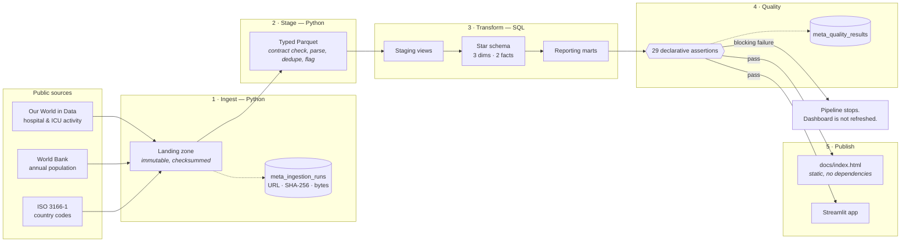
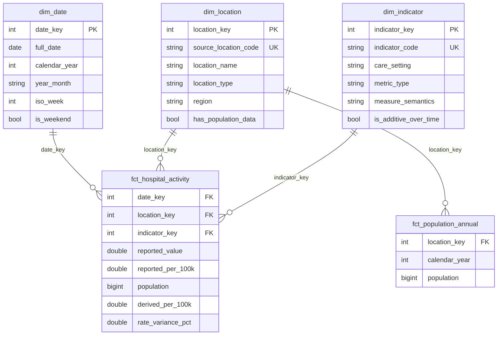

# Architecture

## The shape of it



The quality gate sits **before** publication on purpose: a dashboard built from
data that failed its own assertions is worse than a stale dashboard, because it
looks current.

## The star



Full column-level documentation: [`data_dictionary.md`](data_dictionary.md).

## Why the work is split the way it is

The brief for this project was "clean it in SQL *and* Python", and the split is
not arbitrary — each language does what it is better at.

**Python does the things SQL expresses badly.**

- *Contract enforcement.* Each landing file is checked against the column
  contract in `config/sources.yml` before anything else runs, so an upstream
  schema change fails loudly at the front door rather than producing a wrong
  number three layers down.
- *Parsing free text into structure.* The publisher packs four separate facts
  into one string — `"Daily ICU occupancy per million"` is a frequency, a care
  setting, a metric type and a unit. `parse_indicator` turns that into typed
  attributes, and refuses to guess: an unrecognised label raises rather than
  silently dropping rows from the model.
- *Windowed statistics.* Outliers are flagged with a median/MAD modified
  z-score computed within each series. SQL can express it; Python expresses it
  legibly.

**SQL does the modelling.** Surrogate keys, conformed dimensions, grain,
aggregation, and the reconciliation arithmetic are all plain SQL in
`sql/`. There is no templating language and no macro layer: the files are
readable on their own, which is the point of putting the model in SQL.

## Design decisions worth defending

**Sequential surrogate keys, not hashes.** The warehouse is rebuilt in full on
every run, so `row_number()` over the natural key is stable for a stable domain
and stays readable while exploring. A pipeline that loaded incrementally, or
built dimensions in parallel, would want a hash of the natural key instead so
keys never depend on load order. That is a real trade-off and this project sits
on the simple side of it deliberately.

**Every dimension has an Unknown member (`-1`).** Without one, an unmatched
fact either vanishes into an inner join or blocks the load. With one, it lands
somewhere countable — and `fct_activity_has_no_unknown_members` then asserts
that nothing actually does.

**The unit is pivoted onto the fact, not into the dimension.** "Daily ICU
occupancy" and "Daily ICU occupancy per million" are one measurement expressed
two ways. Treating them as two dimension members would double the row count and
make every rate query a self-join.

**Stock versus flow is carried on the dimension.** Occupancy is a count of beds
filled at an instant; summing it across days counts the same patient once per
night. Admissions are events in a period and may be summed. Recording that as
`is_additive_over_time` is what lets `mart_monthly_activity` aggregate each
measure correctly instead of relying on the next person to remember.

**Population is a fact, not a dimension attribute.** It is a measured quantity
that changes every year. On the dimension it would have to be either frozen at
one value or managed as a slowly-changing dimension, for what is simply an
annual measurement.

**The dimension is bigger than the fact.** `dim_location` carries all 249 ISO
countries though only ~50 report activity. A conformed dimension describes the
domain; the facts describe what was measured. `reports_hospital_activity`
records the difference.

## Failure modes this design defends against

| Failure | What catches it |
| --- | --- |
| Publisher renames or drops a column | Column contract in `config/sources.yml`, checked at staging |
| Truncated or partial download | Byte count, `min_rows` contract, and an atomic rename so a partial file never lands |
| A new upstream indicator appears | `parse_indicator` raises rather than dropping the rows |
| A publisher code that is not ISO | `config/location_overrides.csv`, plus an assertion that every reporting location has a region |
| World Bank aggregates double-counting population | Classified against ISO 3166 in staging, excluded in `stg_population`, asserted in the model tests |
| Duplicate rows fanning out a join | Grain uniqueness assertions on both facts |
| A silently rebased denominator upstream | The derived-rate reconciliation and its tolerance assertion |
| A gap in the date dimension dropping facts | `dim_date_is_gapless` |
| A republished but truncated upstream file | `series_has_not_regressed` |
| A dashboard built from bad data | The quality gate runs before publication and stops the run |

## Layout

```
config/           source registry, quality suite, model prose, location overrides
pipelines/        ingest · stage · warehouse · quality · dashboard · charts · cli
sql/staging/      typed views over the staged Parquet
sql/marts/        the star schema and the reporting marts, in build order
dashboard/        the Streamlit app
scripts/          data dictionary generator
tests/            124 tests, all runnable offline against committed fixtures
docs/             the published dashboard and this documentation
data/             landing zone, staged Parquet, DuckDB file (all gitignored)
```
